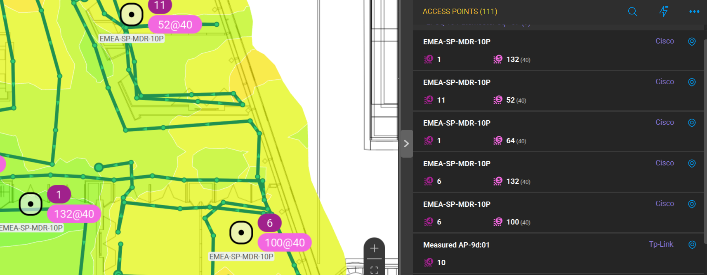
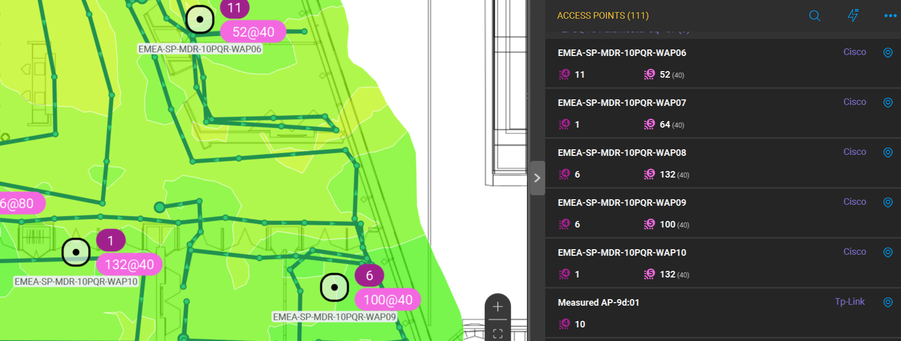

Have you ever tried to analyze the RF site survey data from Ekahau survey project and find out that access points have no names?

There are two possible reasons:
* Special feature for broadcasting AP names in 802.11 beacon frames should be enabled (Cisco Aironet IE)
* Even when this feature is enabled, it broadcasts only 15 symbols. That is why AP that has the perfect self-describing name **"US-Alabama-Office-3-Floor-5-Room-335-right-corner-just-above-your-head"** will become featureless **"US-Alabama-Offi"**

Luckily if you have Cisco WLAN equipment and can collect WLC config file, you can solve this problem with help of this tool.

If you are not Python guru and prefer ready-to-use executables, please go to special repository:
https://github.com/consulttelecom/ekahau-cisco-ap-gui


## AP name adder for Ekahau project files

Python script to add the names of access points into the Ekahau survey project file.
Cisco WLC config file is used as the source of data about AP names.


Example of project data before using this tool (all AP names are the same due to 15 symbols limit):



After using this tool (the project file is enriched with data from WLC config and all AP names are fulfilled)   :



***How to use the tool:***


Copy survey project file and Cisco WLC config file in tool file folder, then just start it from command line with two arguments:

* First argument is the filename of WLC config file
* Second argument is the filename of Ekahau project file

	```
	Example of tool output
	(venv) PS C:\Users\rpodoyni\Ekahau_tools> python.exe .\add_ap_names.py show_run_aireos Floor_3_merged.esx        
	Called the function to extract BSSIDs from config file C:\Users\rpodoyni\Ekahau_tools\show_run_aireos
	Try to open file with name C:\Users\rpodoyni\Ekahau_tools\show_run_aireos
	The WLC config file is parsed, the number of BSSID-AP name pairs is 116
	Changed AP name in project file  EMEA-SP-MDR-10P  to  EMEA-SP-MDR-10PQR-WAP09
	Changed AP name in project file  EMEA-SP-MDR-10PQR-WAP09  to  EMEA-SP-MDR-10PQR-WAP09
	Changed AP name in project file  EMEA-SP-MDR-10P  to  EMEA-SP-MDR-10PQR-WAP06
	Changed AP name in project file  Measured AP-39:a4  to  EMEA-SP-MDR-10PQR-AP705
	Changed AP name in project file  EMEA-SP-MDR-10P  to  EMEA-SP-MDR-10PQR-WAP10
	Changed AP name in project file  Measured AP-f0:eb  to  EMEA-SP-MDR-10PQR-WAP07
	New project file is ready to use, filename is C:\Users\rpodoyni\Ekahau_tools\Floor_3_merged.esx_modified.esx
	(venv) PS C:\Users\rpodoyni\Ekahau_tools>
	```


## Compatible with data from these Cisco wireless controllers:
* Cisco AireOS WLC (collect the output of **show running-config** command)
* Cisco 9800 WLC (collect the output of **show tech-support wireless** command)


## Tested with:

* Ekahau PRO 10
* Ekahau AI PRO 11

## Dependencies:
The following list of standard Python libraries are used in this tool:
* shutil
* zipfile
* json
* os
* logging
* sys

All of these are standard libraries and do not require any installation efforts.

### This tool is inspired by the following works of smart Wi-Fi guys:
* https://github.com/francoisverges/semfio-ekahau
* http://nerdian.ca/files/2020/06/EkahauFileStructure.pdf

### How to get in touch for support\questions\ideas etc.
Collaboration via github tools is the preferred way, so open the issue, make pull request, fork, star etc.
Please add the following data to your issues:
* log file written during the issue (Ekahau.log from root folder)
* describe your environment (PC, OS version, Python version, libraries version)